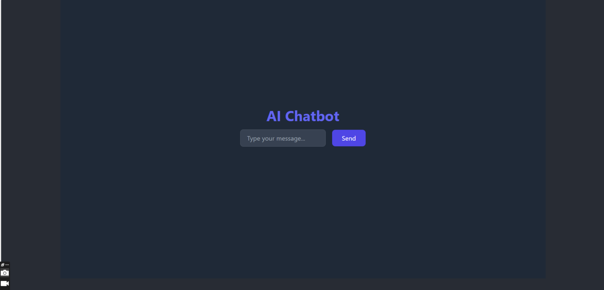

# Kestra Webhook Example

This project is a React application that integrates with a Kestra webhook. It allows users to input content generation parameters such as **topic**, **tone**, and **style**, and sends these inputs to a webhook endpoint. The application displays the execution ID returned by the Kestra webhook upon successful submission.

---

## Table of Contents

1. [Features](#features)
2. [Demo](#demo)
3. [Getting Started](#getting-started)
   - [Prerequisites](#prerequisites)
   - [Installation](#installation)
4. [Technologies Used](#technologies-used)
5. [Screenshots](#screenshots)

---

## Features

- **User Input Form**: Capture user inputs for content generation.
- **Webhook Integration**: Send data to Kestra's webhook endpoint using Axios.
- **Execution ID Display**: Show the execution ID returned from Kestra.
- **CORS Support**: Compatible with CORS configurations for secure requests.
- **Modern UI**: Styled with Tailwind CSS for a responsive, clean interface.

---

## Demo

This project currently does not have a hosted demo. You can run it locally by following the instructions below.

---

## Getting Started

### Prerequisites

Ensure you have the following installed on your system:

- **Node.js** (v14 or above)
- **npm** or **yarn**
- A running Kestra instance with a webhook endpoint configured.

### Installation

1. Clone the repository:

   ```bash
   git clone https://github.com/uchiha-vivek/HackTheFrost.git
   cd HackTheFrost
    ```
2. Install the dependencies:

    ```bash
    npm install
    ```

3. Setup environment variables

4. Start the development server:
    ```bash
    npm run dev
    ```

5. Open the application in your browser:
    ```bash
    http://localhost:5000/

## Technologies Used

1. React: Frontend library for building the UI.
2. Axios: For making HTTP requests.
3. Kestra: Workflow orchestration tool.
4. Tailwind CSS: Utility-first CSS framework for styling

## Screenshots Of The Project

<br />